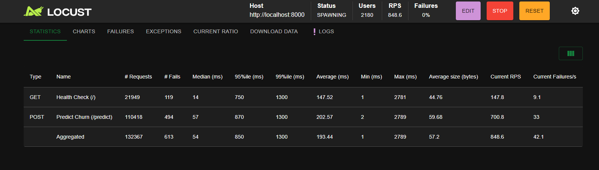
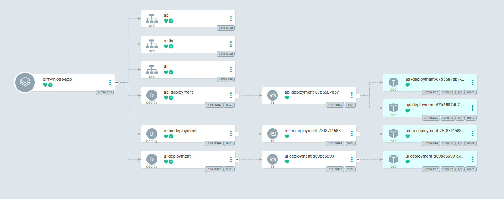

# CRM Churn Prediction Engine


A highly scalable, production-ready Machine Learning serving architecture designed to predict customer churn in real-time. This repository demonstrates a complete GitOps-driven MLOps lifecycle, featuring an asynchronous inference layer, graceful degradation caching, and Kubernetes orchestration.

## Proof of Architecture & System Metrics
This system is engineered for high availability and extreme load tolerance. It moves beyond a simple API wrapper by implementing true MLOps best practices.

* **High-Throughput Inference:** Achieved 864+ Requests Per Second (RPS) with 2100+ concurrent users during localized stress testing, maintaining a 0% failure rate under optimal conditions.



* **Graceful Degradation:** The serving layer utilizes Redis for microsecond-level prediction caching. If the cache layer becomes unavailable or times out, the system automatically bypasses the cache and executes real-time ONNX inference without dropping the client request.

* **Experiment Tracking & Registry (MLflow):** Every training run is logged with its respective hyperparameters and evaluation metrics (Accuracy, F1-Score). The MLflow Model Registry acts as the single source of truth, ensuring only validated and versioned models transition into the production environment.


* **Declarative GitOps Deployment (ArgoCD):** The state of the Kubernetes cluster is continuously reconciled with the Git repository using ArgoCD. This ensures Zero Drift between the desired state in Helm charts and the actual state in production, enabling automated "Self-Healing" and seamless version rollouts.



* **Memory-Optimized Engine:** The pipeline uses ONNX runtime for predictions, completely decoupling the heavy Scikit-Learn training environment from the lightweight serving environment.
* **Infrastructure as Code (IaC):** Entire deployment topology, including load balancers, replicas, and network policies, is declaratively managed via Helm charts.

### AWS
To demonstrate the production-ready nature of the infrastructure, the following recording illustrates the real-time interaction with the **Streamlit UI**, hosted on **AWS EC2**. 

The showcase highlights:
- **Real-Time Inference:** Seamless communication between the UI and the **FastAPI** backend.
- **Optimized Performance:** Sub-millisecond latency powered by **ONNX Runtime** and **Redis** caching.
- **Cloud Stability:** The system running on a fully provisioned **Terraform** environment with automated **CI/CD** updates.


## Local Environment & Deployment
The repository is fully automated using a Makefile for unified developer experience. 

### Prerequisites
* Docker & Docker Desktop (with Kubernetes enabled)
* Python 3.11+
* Helm

### Running Locally (Docker & Python)
To set up the environment and run the bare-metal application:

```bash
    # Install dependencies
    make install

    # Train the model and generate preprocessor objects
    make train

    # Start the FastAPI application locally
    make run
```

### Deploying to Kubernetes (GitOps / Helm)
To deploy the fully containerized stack (API, UI, Redis) to your local Kubernetes cluster:
```bash
    # Build Docker images and deploy the Helm chart
    make helm-up

    # To destroy the cluster resources and clean the environment
    make helm-down

    # To track cluster
    make helm-status
```

## Testing Strategies
Quality assurance is enforced at multiple levels of the pipeline, from data transformation logic to HTTP response integrity.

### Unit and Integration Tests (Pytest)
The test suite isolates the Data Transformation components, the ML Pipeline engine, and the FastAPI endpoints.
```bash
    # Run all unit and integration tests
    make test
```